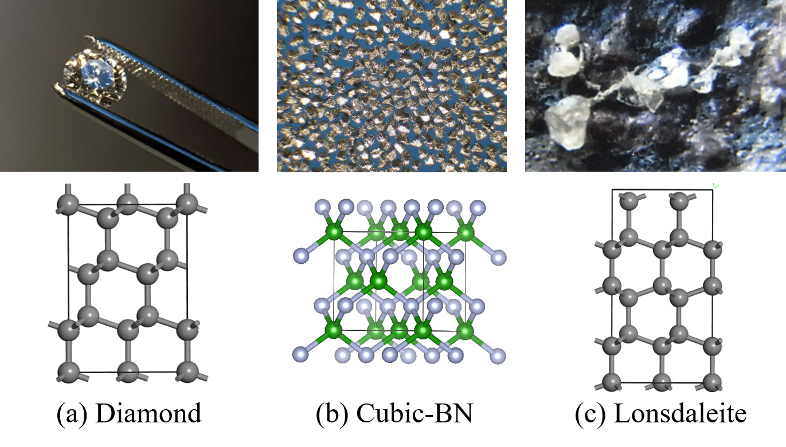

+++
# Date this page was created.

# Project title.
title = "Computation of Ideal Strength of Superhard Materials"
font_size="12"

# Project summary to display on homepage.
summary = ""

weight = 2

# Tags: can be used for filtering projects.
# Example: `tags = ["machine-learning", "deep-learning"]`
tags = ["scientific computing"]
categories = []

# Optional external URL for project (replaces project detail page).
external_link = ""

# Slides (optional).
#   Associate this project with Markdown slides.
#   Simply enter your slide deck's filename without extension.
#   E.g. `slides = "example-slides"` references 
#   `content/slides/example-slides.md`.
#   Otherwise, set `slides = ""`.
slides = "" # //bit.ly/rlel-github-meetup

# Links (optional).
url_pdf = ""
url_slides = ""
url_video = ""
url_code = ""

# Custom links (optional).
#   Uncomment line below to enable. For multiple links, use the form `[{...}, {...}, {...}]`.
url_custom = []

# Does the project detail page use math formatting?
math = true

# Featured image
# To use, add an image named `featured.jpg/png` to your page's folder. 
[image]
  # Caption (optional)
  caption = ""

  # Focal point (optional)
  # Options: Smart, Center, TopLeft, Top, TopRight, Left, Right, BottomLeft, Bottom, BottomRight
  focal_point = "Smart"
  
  # Show image only in page previews?
  preview_only = true

+++
<h8 style="text-align: justify;">
  
There are many kinds of superhard materials in nature. Interesting phenomena occur when superhard materials are subjected to external stress. We have studied three superhard materials: diamond, cubic boron nitride and Lonsdaleite, and explored their behavior when subjected to stress in different directions through computational physics methods.

<figure>
 
  <figcaption>
      <h10>Fig. 1. Three kinds of super-hard crystal</h10>
  </figcaption>
</figure>

As is known to all, pixel is the smallest unit of CMOS/CCD imaging traditionally. However, using sub-pixel fitting is an efficient way to break this limit. Based on this, a high-precision testing system whose minimum resolution is 0.1µm has been established. Figure 2 shows the procedures of using the sub-pixel fitting based analysis software (time-axis). 

<!-- <figure>
 
  <figcaption>
      <h10>Figure.2 Procedure of the time-axis fitting software</h10>
  </figcaption>
</figure>

The time-axis analysis software (as shown in Figure 3) based on sub-pixel fitting and Microsoft Foundation Classes (MFC) can output the relationship between time and feature point’s displacement, thus the amplitude and frequency of microactuators can be derived accurately. Similar to this time-axis analysis software, spatial-axis analysis software which shows the moving trail of micro-actuators’ feature point has been constructed as well.  
Due to its advantages, the measuring method and system established in this project is expected to improve the quality of microactuators’ testing and be widely used in research of MEMS.</h8>

<figure>
 
  <figcaption>
      <h10>Figure.3 Interface of the time-axis fitting software</h10>
  </figcaption>
</figure> -->
