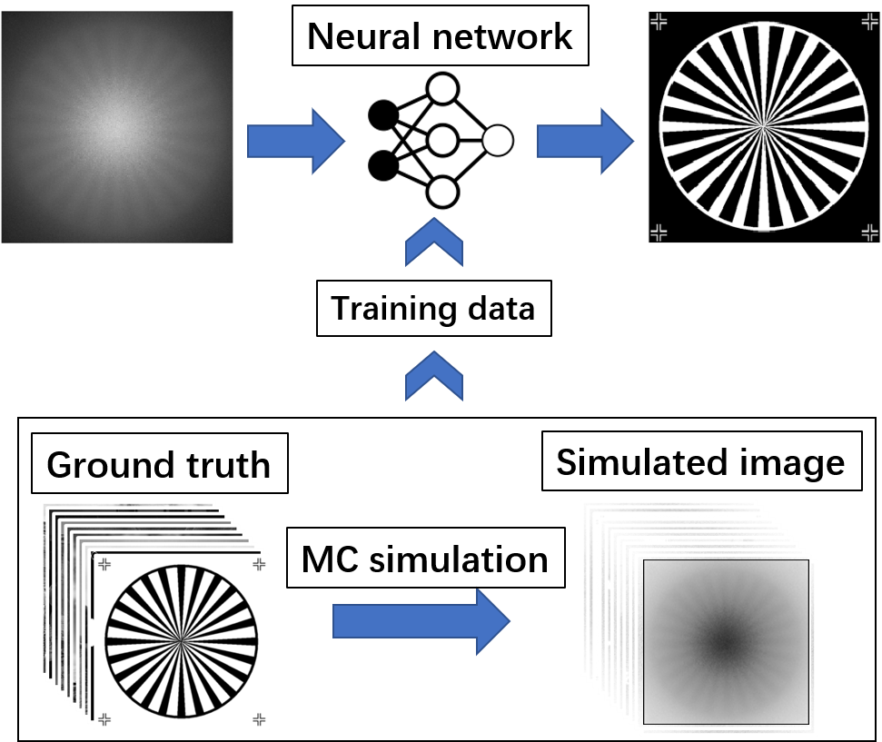
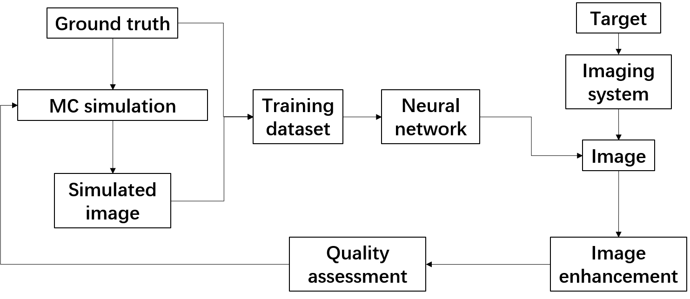

+++
# Date this page was created.
date = 2020-05-23T00:00:00

# Project title.
title = "Learn from simulation, Deep learning based image denoising of underwater range-gated imaging"
font_size="12"

# Project summary to display on homepage.
summary = "Build a Monte-Carlo Active Imaging Simulation Platform(MAISP) and studied backscattering effect of water in range-gated imaging."

weight = 2

# Tags: can be used for filtering projects.
# Example: `tags = ["machine-learning", "deep-learning"]`
tags = ["deep-learning", "imaging"]
categories = []

# Optional external URL for project (replaces project detail page).
external_link = ""

# Slides (optional).
#   Associate this project with Markdown slides.
#   Simply enter your slide deck's filename without extension.
#   E.g. `slides = "example-slides"` references 
#   `content/slides/example-slides.md`.
#   Otherwise, set `slides = ""`.
slides = "" # //bit.ly/rlel-github-meetup

# Links (optional).
url_pdf = ""
url_slides = ""
url_video = ""
url_code = ""

# Custom links (optional).
#   Uncomment line below to enable. For multiple links, use the form `[{...}, {...}, {...}]`.
url_custom = []

# Does the project detail page use math formatting?
math = true

# Featured image
# To use, add an image named `featured.jpg/png` to your page's folder. 
[image]
  # Caption (optional)
  caption = ""

  # Focal point (optional)
  # Options: Smart, Center, TopLeft, Top, TopRight, Left, Right, BottomLeft, Bottom, BottomRight
  focal_point = "Smart"
  
  # Show image only in page previews?
  preview_only = true

+++
<h8 style="text-align: justify;">

According to the previous research on the mechanism of scattered light in gated imaging, we found that in order to further increase the working distance of gated imaging, the use of snake-like photon is the key. However, how to use the snake-like photon is a more difficult problem, because although the snake-like photon contains some of the target information, this part of the target information is blurred to different degrees. Compared with the signal photon, it will blur the target signal, but compared to the scattering photon, it will increase target information. The traditional denoising method regards the actual image as a simple superposition of the target signal and the scattering light, and subtracts the scattered light from the original image, but this is not completely in line with reality, so the best denoising effect cannot be obtained.  

We are looking for deep learning based algorithms for underwater range-gated image denoising. However, the main difficulty is that the dataset of the underwater range-gated images is small, and it is hard to train the deep learning model. Besides, it is a time-consuming task to obtain a large number of underwater range-gated images.

<figure>
 
  <figcaption>
      <h10>Fig. 1. Learning from simulation.</h10>
  </figcaption>
</figure>

We developed a way to generate underwater range-gated image dataset through Monte-Carlo simulation. The simulation, training and feedback process is described in Fig. 1, Fig. 2.  

<figure>
 
  <figcaption>
      <h10>Fig. 2. Simulation, training and feedback process.</h10>
  </figcaption>
</figure>

We performed a lot of simulations, and generated more than 1000 simulated images. Some of them are shown in Fig. 3. The simulation takes RGB image and the depth map as inputs. Example images are simulated from NYU-Depth-v2 dataset.

<figure>
 
  <figcaption>
      <h10>Fig. 3. Simulated range-gated image.</h10>
  </figcaption>
</figure>

This is still an onging project and further work need to be done. All the work is carried out under the supervision of Prof. Xinwei Wang, at Institute of Semiconductors, Chinese Academy of Sciences.
