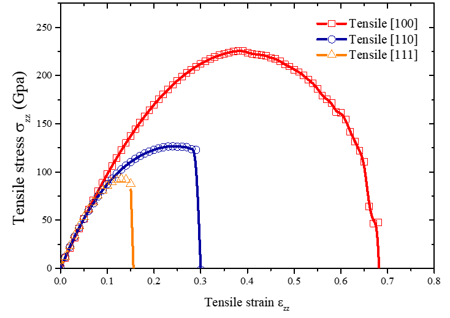
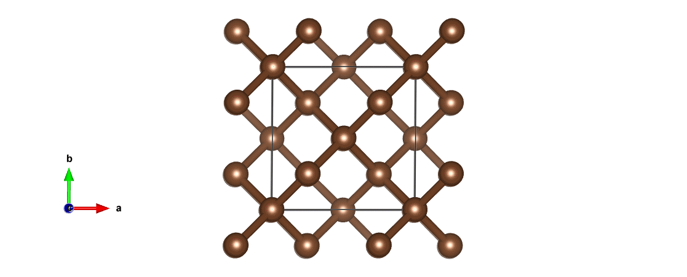
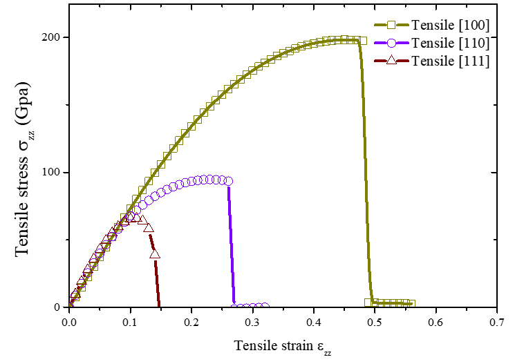
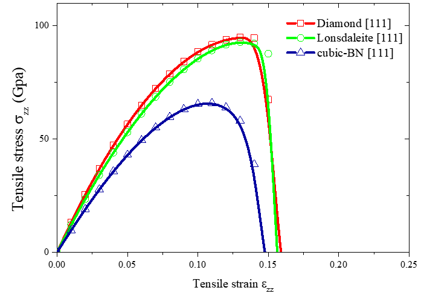
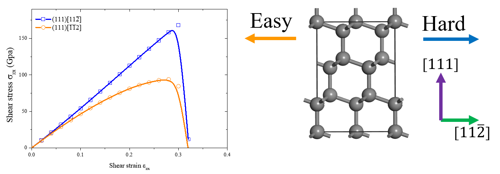
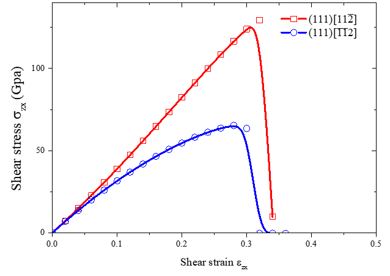
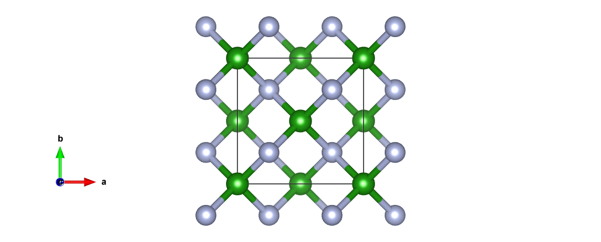
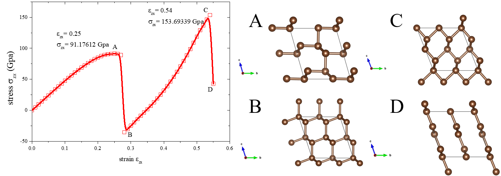
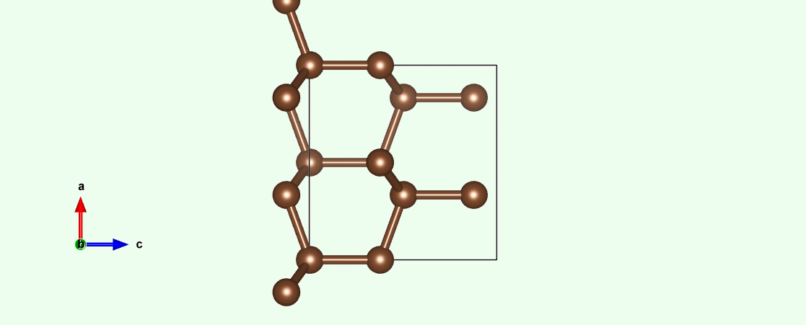

+++
# Date this page was created.
date = 2018-08-27T00:00:00

# Project title.
title = "Computation of Ideal Strength of Superhard Materials"
font_size="12"

# Project summary to display on homepage.
summary = "Study some interesting phenomena of superhard materials via scientific computing techniques."

weight = 2

# Tags: can be used for filtering projects.
# Example: `tags = ["machine-learning", "deep-learning"]`
tags = ["scientific computing"]
categories = []

# Optional external URL for project (replaces project detail page).
external_link = ""

# Slides (optional).
#   Associate this project with Markdown slides.
#   Simply enter your slide deck's filename without extension.
#   E.g. `slides = "example-slides"` references 
#   `content/slides/example-slides.md`.
#   Otherwise, set `slides = ""`.
slides = "" # //bit.ly/rlel-github-meetup

# Links (optional).
url_pdf = ""
url_slides = ""
url_video = ""
url_code = ""

# Custom links (optional).
#   Uncomment line below to enable. For multiple links, use the form `[{...}, {...}, {...}]`.
url_custom = []

# Does the project detail page use math formatting?
math = true

# Featured image
# To use, add an image named `featured.jpg/png` to your page's folder. 
[image]
  # Caption (optional)
  caption = ""

  # Focal point (optional)
  # Options: Smart, Center, TopLeft, Top, TopRight, Left, Right, BottomLeft, Bottom, BottomRight
  focal_point = "Smart"
  
  # Show image only in page previews?
  preview_only = true

+++
<h8 style="text-align: justify;">

<figure>
 
  <figcaption>
      <h10>Fig. 1. Three kinds of super-hard crystal</h10>
  </figcaption>
</figure>

There are many kinds of superhard materials in nature. Interesting phenomena occur when superhard materials are under strain. We have studied three superhard materials: diamond, cubic boron nitride and Lonsdaleite, and explored their behavior when under strain in different directions through computational physics methods.

<figure>
 
  <figcaption>
      <h10>Fig. 2. Calculated tensile stress versus tensile strain for diamond</h10>
  </figcaption>
</figure>

Calculation on diamond shows that its easy cleavage direction is [111] [Fig. 2]. The crystal structure of diamond changes when it is subjected to tensile strain, and eventually turns into graphite [Fig. 3].

<figure>
 
  <figcaption>
      <h10>Fig. 3. Atomistic-level mechanism of strain-stress curve of diamond</h10>
  </figcaption>
</figure>

Calculation on cubic-BN shows that its easy cleavage direction is also [111] [Fig. 4].

<figure>
 
  <figcaption>
      <h10>Fig. 4. Calculated tensile stress versus tensile strain for BN</h10>
  </figcaption>
</figure>

Calculation results show that the tensile strength (along weakest tensile direction) is approximately: Lonsdaleite ~ Diamond > cubic-BN, shown as Fig. 5.

<figure>
 
  <figcaption>
      <h10>Fig. 5. Calculated tensile stress versus tensile strain for diamond, BN and lonsdaleite</h10>
  </figcaption>
</figure>

We also draw the strain-stress graph of above three mineral under shear strain. Result is shown in Fig. 6 and Fig.7.

<figure>
 
  <figcaption>
      <h10>Fig. 6. Calculated shear stress versus shear strain on plane (111) of diamond</h10>
  </figcaption>
</figure>

<figure>
 
  <figcaption>
      <h10>Fig. 7. Calculated shear stress versus shear strain on plane (111) of cubic-BN</h10>
  </figcaption>
</figure>

Also the atomistic-level mechanism of strain-stress curve of cubic-BN is shown in Fig. 8. This time c-BN is converted into h-BN under shear strain.

<figure>
 
  <figcaption>
      <h10>Fig. 8. Atomistic-level mechanism of strain-stress curve of c-BN</h10>
  </figcaption>
</figure>

However, the most interesting phenomenon occurs when we apply indentation stress on lonsdaleite. Fig. 9 shows the strain-stress curve of lonsdaleite becomes "zig-zag" under indentation stress. It is because the crystal structure changes many times under the whole process. The atomistic-level mechanism is shown in Fig. 10.

<figure>
 
  <figcaption>
      <h10>Fig. 9. Calculated stress versus strain on plane (111) of lonsdaleite, crystal structure at point A ,B, C and D shown on the right</h10>
  </figcaption>
</figure>

<figure>
 
  <figcaption>
      <h10>Fig. 10. Atomistic-level mechanism of strain-stress curve of lonsdaleite under indentation stress</h10>
  </figcaption>
</figure>

All the calculations are carried out through the modified Vienna Ab-initio Simulation Package (VASP) program, under the supervision of Prof. Xiang-feng Zhou at the School of Physics, Nankai University.

____________________________________________
References:

[1] Bing Li, Hong Sun, and Changfeng Chen, Phys. Rev. Lett. 117, 116103 (2016).  
[2] Zicheng Pan, Hong Sun, Yi Zhang, and Changfeng Chen, Phys. Rev. Lett. 102, 055503 (2009).  
[3] David Roundy, and Marvin L. Cohen, Phys. Rev. B 64, 212103 (2001).  
[4] Zicheng Pan, Hong Sun, and Changfeng Chen, Phys. Rev. B 79, 104102 (2009).  
[5] H. Chacham, and Leonard Kleinman, Phys. Rev. Lett. 85, 4904 (2000).  
[6] Yi Zhang Hong Sun, and Changfeng Chen, Phys. Rev. Lett. 93, 195504 (2004).  
[7] R. H. Telling, C. J. Pickard, M. C. Payne, and J. E. Field, Phys. Rev. Lett. 84, 5160 (2000).  
[8] P. E. Blöchl, Phys. Rev. B 50, 17953 (1994).   
[9] G. Kresse, and J. Furthmüller, Phys. Rev. B 54, 11169 (1996);  Comput. Mater. Sci. 6, 15 (1996).  
[10] J. P. Perdew, K. Burke, and M. Ernzerhof, Phys. Rev. Lett. 77, 3865 (1996).  
