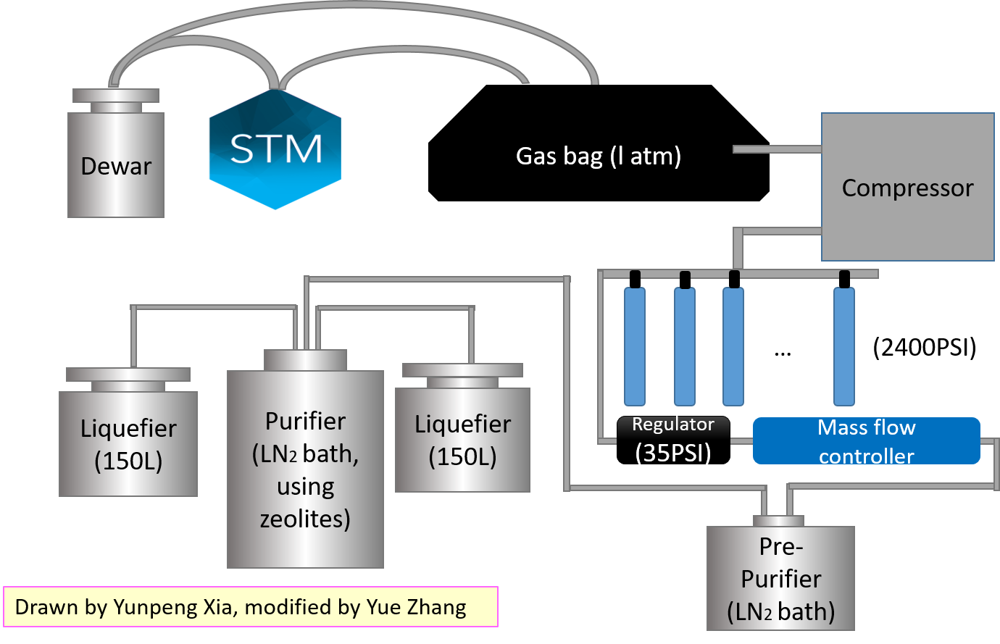
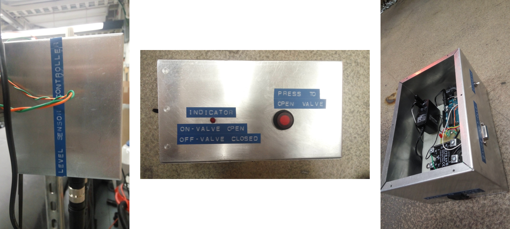

+++
# Date this page was created.

# Project title.
title = "Help to build the helium recovery system of Ho-lab, UC, Irvine"
font_size="12"

# Project summary to display on homepage.
summary = ""

weight = 2

# Tags: can be used for filtering projects.
# Example: `tags = ["machine-learning", "deep-learning"]`
tags = ["electronics"]
categories = []

# Optional external URL for project (replaces project detail page).
external_link = ""

# Slides (optional).
#   Associate this project with Markdown slides.
#   Simply enter your slide deck's filename without extension.
#   E.g. `slides = "example-slides"` references 
#   `content/slides/example-slides.md`.
#   Otherwise, set `slides = ""`.
slides = "" # //bit.ly/rlel-github-meetup

# Links (optional).
url_pdf = ""
url_slides = ""
url_video = ""
url_code = ""

# Custom links (optional).
#   Uncomment line below to enable. For multiple links, use the form `[{...}, {...}, {...}]`.
url_custom = []

# Does the project detail page use math formatting?
math = true

# Featured image
# To use, add an image named `featured.jpg/png` to your page's folder. 
[image]
  # Caption (optional)
  caption = ""

  # Focal point (optional)
  # Options: Smart, Center, TopLeft, Top, TopRight, Left, Right, BottomLeft, Bottom, BottomRight
  focal_point = "Smart"
  
  # Show image only in page previews?
  preview_only = true

+++
<h8 style="text-align: justify;">

<figure>
 
  <figcaption>
      <h10>Fig. 1. Helium recovery system</h10>
  </figcaption>
</figure>

I was a research intern student at Prof. Wilson Ho's Lab, UC, Irvine, from Jul 2016 to Sept 2016. During that time, I helped to build the helium recovery system [Fig. 1] of the lab. I made three electronic boxes [Fig. 2], which were level sensor controller box, gas bag relief box and solenoid valve controller box (for STM chamber).  

<figure>
 
  <figcaption>
      <h10>Fig. 2. Three electronic boxes. Left: level sensor controller, middle: gas bag relief, right: solenoid valve controller</h10>
  </figcaption>
</figure>

Level sensor controller circuit was kind of digital circuit which controls the working status of compressor automatically. On the helium recovery system, a large gas bag was used to storage helium gas. The helium gas was storage into the gas bag before compressed into steel cylinder. When the gas bag grew high enough, the compressor should start to work to compress helium gas from gas bag, while compressor need to stop when there was not too much helium gas remained in the gas bag. So the design of sensors look like a kind of photogate. The digital circuit can read the status of the high sensor and low sensor, then it controlled the working status of compressor by letting out digital signals. The microcontroller unit was kind of Arduino, which were widely used under different circumstances of automation.

Gas bag relief box was also a kind of auto controlling circuit. It was used in case the level sensor fails or a power failure occurs. The box can relieve the gas bag when the pressure of gas bag was over 0.05psi. 

The solenoid valve controller box (STM I) is used to protect the vacuum of STM chamber. When the outer pressure is higher than a certain value, the controller box will close the solenoid valve so that the chamber won’t be polluted by the outer air. When the pressure is low enough, as can be seen on the screen of host computer, the solenoid valve can be opened by pressing the override button on the box. Override function is added to achieve manually reset, which means constrainedly open the valve even the pressure is higher than critical value. Another function for the control box is power failure protection. when a power failure occurs or power recovers, it can close the valve to protect the chamber from getting polluted.

All the work are carried out under the supervision of Prof. Wilson Ho at the UC, Irvine.
